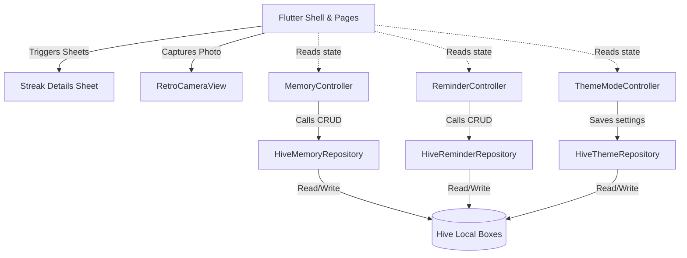

# 🪐 OIYA — External Memory System

[](https://flutter.dev)
[](https://dart.dev)
[](https://flutter.dev)
[](LICENSE)

**OIYA** is a premium, retro-styled external memory system and interactive habit builder designed to help users capture thoughts, build consistent habits, and track schedules. Combining tactile retro elements (like a simulated Polaroid camera) with modern productivity mechanics (like Duolingo-style streaks and smart exam scheduling), OIYA focuses on speed, simplicity, and delight.

---

## 🎨 Core Philosophy & Design

* **Zero-Lag Capture**: Capture fleeting thoughts in seconds with a keyboard-first, frictionless interface.
* **Tactile Interactions**: Immersive tactile and visual feedback including retro sound simulation concepts, realistic camera flash overlays, and custom light haptic feedback.
* **Humorous Delight**: Simulates task verification with whimsical vector doodles instead of heavy binary storage, keeping the codebase ultra-efficient.
* **Offline-First Privacy**: Your thoughts, schedules, and photos stay entirely on your device with local Hive DB storage.

---

## 🚀 Key Feature Modules

### 1. Memory Vault & Journal
* **Quick Capture Panel**: Instantly log text memories, quotes, or thoughts.
* **Vault Stream**: Chronological feed of memories featuring full-text fuzzy search and custom date grouping.
* **Memory Resurfacing**: An intelligent system that resurfaces notes from exactly 7, 14, and 30 days ago to reinforce past learnings.

### 2. Gamified Habit Streak System
* **Unified Activity Tracking**: Log a journal entry or complete a scheduled task to keep your daily streak alive.
* **Card-Level Flame Badges**: Interactive `🔥 Xd` flame badges displayed on each habit card.
* **Consistency Sheets**: Tapping a streak badge opens an analytical bottom sheet containing:
  * **Completions Metric**: Lifetime completion count.
  * **14-Day Completion Rate**: Total successful days divided by scheduled days.
  * **Visual Calendar Grid**: A 2x7 color-coded matrix tracking the last 14 days:
    * 🟢 **Checkmark (Green)**: Completed.
    * 🟡 **Pulsing Dot (Orange)**: Pending today.
    * 🔴 **Cross (Red)**: Missed scheduled day.
    * ⚪ **Dash (Muted)**: Scheduled off-day.

### 3. Retro Polaroid Proof Verification
* **Simulated Retro Viewfinder**: Real-time camera guides, mock ISO / shutter speed metrics, active flash fading, and Polaroid print-out slide animations.
* **Vector Doodle Renderer**: The app dynamically draws a vector representation of your task (e.g. draws a bed for `"Clean the bed"`, books for `"Study"`) as "Polaroid photos", keeping file size to minimal string coordinates.
* **Convenience Bypass**: Skip the camera verification path at any time to mark the habit complete immediately.

### 4. Smart Exam Prep Mode
* **T-1 Day Scheduling**: Enter your exam dates, and OIYA automatically schedules prep habits exactly **1 day before** each exam date.
* **Dynamic Calendar Feeds**: Interactive chips let you manage upcoming exam sessions with clean, real-time recalculations.

---

## 🛠️ Technology Stack & Architecture

* **Framework**: [Flutter](https://flutter.dev) (v3.44.0 stable)
* **State Management**: [Riverpod](https://riverpod.dev) (highly decoupled, reactive, testable provider tree)
* **Database**: [Hive](https://pub.dev/packages/hive) (fast, type-safe, lightweight local key-value storage)
* **Styling**: `OiyaStyles` vanilla design token system (Midnight Indigo palette, custom typography scale, dark mode compatibility)
* **Formatting & Time**: [Intl](https://pub.dev/packages/intl) for locale-aware date styling.

### Architecture Data Flow


---

## 📂 Repository Structure

```
lib/
├── main.dart                          # Startup configuration, Hive adapters & DB migrations
└── src/
    ├── app.dart                       # Root Material/Cupertino app config and theme bindings
    ├── features/
    │   ├── memory/                    # Feature Core Layer
    │   │   ├── memory_note.dart       # Note entity schemas
    │   │   ├── memory_repository.dart # Hive adapters for notes
    │   │   ├── memory_controller.dart # Note state state management
    │   │   ├── reminder.dart          # Habit schemas (completion & schedule dates)
    │   │   ├── reminder_repository.dart # Hive adapters for habits
    │   │   ├── reminder_controller.dart # Habit & Exam scheduler controller
    │   │   └── streak_controller.dart # Global streak computer
    │   └── settings/
    │       ├── theme_repository.dart  # Persisted theme configurations
    │       └── theme_mode_controller.dart # Active theme switcher
    └── ui/                            # View presentation layer
        ├── main_shell.dart            # Main navigation shell, Tab Controllers, Streak Sheet
        └── retro_camera_view.dart     # Mock retro lens viewfinder & doodle generator
```

---

## ⚡ Getting Started

### Prerequisites

* [Flutter SDK](https://docs.flutter.dev/get-started/install) (`>= 3.44.0`)
* [Dart SDK](https://dart.dev/get-started) (`>= 3.12.0`)
* Active Android Emulator, iOS Simulator, or Desktop device.

### Setup & Run

1. **Clone the repository:**
   ```bash
   git clone https://github.com/your-username/oiya.git
   cd oiya
   ```

2. **Retrieve dependencies:**
   ```bash
   flutter pub get
   ```

3. **Check environment status:**
   ```bash
   flutter doctor
   ```

4. **Compile and run in debug mode:**
   ```bash
   # Run on any available device
   flutter run
   
   # Specific targets
   flutter run -d emulator-5554    # Target specific Android emulator
   flutter run -d chrome           # Target Web client
   flutter run -d windows          # Target Windows desktop App
   ```

5. **Static Code Quality Checks:**
   ```bash
   flutter analyze
   ```

---

## 💾 Database Migrations & Cleanups

OIYA features a self-healing local database schema. To prevent debug mock completions from filling your clean Memory Vault, the app executes a light migration at launch:
* Scans the `memories` box.
* Trims out any entries containing Polaroid placeholder completion strings (e.g. `Verified Polaroid Proof` or `Polaroid #OIYA-`).
* Keeps user-written memory notes completely untouched.

---

## 📄 License

Proprietary Software. All rights reserved.
